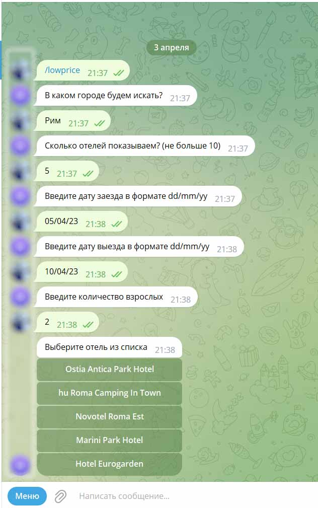
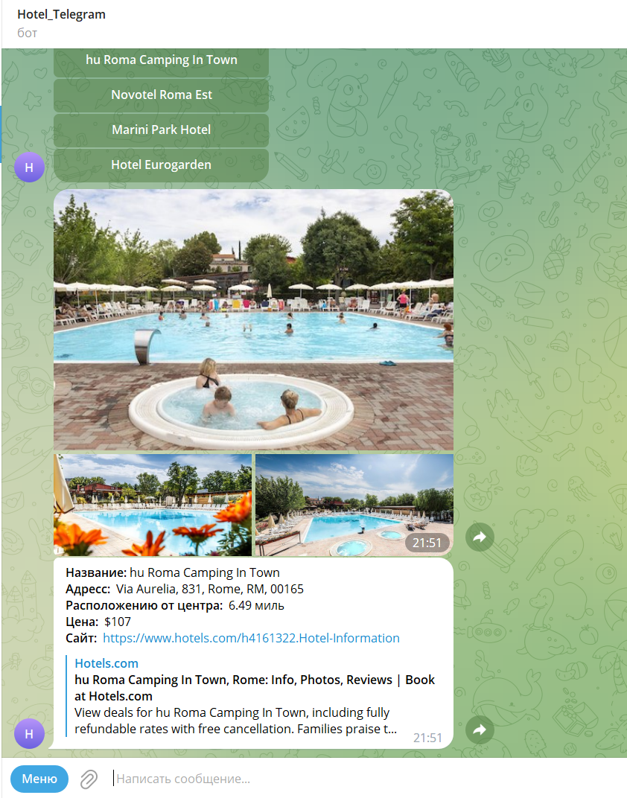

# Поиск отелей в Telegram
___
## О боте:
Бот предназначен для поиска и сортировки отелей, запрашиваемых с сайта www.rapidapi.com. В боте реализованы такие функции как:
+ /lowprice - вывод самых дешёвых отелей в городе;
+ /highprice - вывод самых дорогих отелей в городе;
+ /bestdeal - вывод отелей, наиболее подходящих по цене и расположению от центра
+ /history - вывод истории поиска отелей
## Requirements
+ Python 3.7+
+ pyTelegramBotAPI – Python Telegram Bot API
+ requests - библиотека requests
+ peewee - ORM
---
## Инструкция по установке и первому запуску
1. Клонируем репозиторий на ваш сервер
 ```
git clone https://github.com/...
``` 
2. Установить зависимости:
````
pip install -r requirements.txt
````
2. Установить ORM Peewee:
````
pip install peewee
````
3. Получить ключ для работы с API
4. Создать нового бота и получить токен для работы с ним
5. Переименовать файл .env.template в .env, указать в нем свой токен для бота и ключ от Rapid API
>Пример файла .env:<br>
BOT_TOKEN='5129698927:AAGDrtF8BhpsZkfJkz8d8V8sd80--------'<br>
RAPID_API_KEY='e16bf7299amsh132539e6181c99dp1996efjsnf55b--------'.
6. Запустить программу
```
python main.py
```
___
## Работа с телеграмм ботом
### Начало работы
Для начала работы отправьте боту команду ``/start``

В меню бота выбрат нужную команду, пройдя опрос бота 


Пройти опрос бота 



Для получения результата, выберете из списка интересующий отель




### Рекомендации
Название города должно состоять только из букв русского или английского алфавита и символа 
дефисжно. Вводите дату в формате "01/01/23" (1 января 2023 г.).  Количество выводимых отелей — целое положительное число. Максимальное возможное количество - 20.